# AI Job Market Salary Prediction

A supervised regression project that predicts annual salary for AI-related job roles
using a linear regression model. Built on a dataset of 1,500 job market records
covering 25 specialisations, 14 countries, and 5 company size categories.

**GitHub:** https://github.com/BibekSubediCR7/AI-Job-Market-Salary-Prediction  
**Dataset:** https://www.kaggle.com/datasets/alitaqishah/ai-jobs-market-2025-2026-salaries  
**Live App:** run `streamlit run streamlit/app.py` after setup
**Live Web App to Surf** https://huggingface.co/spaces/bibeksubedi7/AI-Job-Market-Salary-Predictor

---

## Table of Contents

1. [Why Linear Regression](#why-linear-regression)
2. [Dataset](#dataset)
3. [Project Structure](#project-structure)
4. [Notebook 1: Exploratory Data Analysis](#notebook-1-exploratory-data-analysis)
5. [Notebook 2: Feature Engineering](#notebook-2-feature-engineering)
6. [Notebook 3: Model Training and Evaluation](#notebook-3-model-training-and-evaluation)
7. [Streamlit App](#streamlit-app)
8. [Results](#results)
9. [Limitations](#limitations)
10. [How to Reproduce](#how-to-reproduce)
11. [Requirements](#requirements)

---

## Why Linear Regression

The goal of this project was not to chase the highest possible accuracy score. It was to
build something interpretable and explainable from end to end.

Linear regression was chosen because it produces a coefficient for every input feature.
That coefficient tells you directly how much each factor, role, location, company size,
moves the predicted salary and in which direction. A gradient boosted tree can often
outperform linear regression on tabular data, but it cannot tell you "being in the USA
adds roughly 26% to your salary compared to Australia." Linear regression can.

For a salary prediction problem, interpretability matters more than the last few points
of R². The audience for this model is someone trying to understand what drives
compensation in the AI job market, not just what a number will be.

---

## Dataset

**Source:** Kaggle, AI Jobs Market 2025-2026 Salaries  
**Records:** 1,500 rows, 21 original columns  
**Target:** `annual_salary_usd` (continuous, USD)  
**Null values:** 0 across all columns

The dataset covers AI and ML-related roles across 2025 and 2026. Salaries range from
$90,000 to $384,000 with a mean of approximately $194,900. The distributions across
experience level, country, and company size are close to balanced, with 280 to 385
records per category in most columns.

**Columns kept for modelling (9 total):**

| Column | Type | Role |
|--------|------|------|
| `job_title` | Categorical (25 unique) | Nominal, one-hot encoded |
| `experience_level` | Categorical (4 levels) | Ordinal, integer encoded |
| `years_of_experience` | Numeric | Scaled |
| `education_required` | Categorical (5 levels) | Ordinal, integer encoded |
| `annual_salary_usd` | Numeric | Target (log-transformed) |
| `country` | Categorical (14 unique) | Nominal, one-hot encoded |
| `remote_work` | Categorical (3 levels) | Nominal, one-hot encoded |
| `company_size` | Categorical (5 levels) | Ordinal, integer encoded |
| `industry` | Categorical (12 unique) | Nominal, one-hot encoded |

**Columns dropped and why:**

| Dropped Column | Reason |
|---------------|--------|
| `job_category` | Redundant with `job_title` |
| `city` | Too granular, country already captures geography |
| `required_skills` | Pipe-delimited multi-label string (1,500 unique combinations), not usable in v1 |
| `ai_salary_premium_pct`, `demand_score`, `demand_growth_yoy_pct` | Derived from target, would cause leakage |
| `benefits_score_10` | Not a job market input a candidate would know |
| `posting_year`, `posting_month` | Near-zero correlation with salary |
| `is_senior`, `is_remote_friendly`, `is_llm_role` | Redundant flags already captured by kept columns |

---

## Project Structure

```
ai-salary-predictor/
│
├── data/
│   ├── raw/
│   │   └── ai_jobs_market.csv
│   └── processed/
│       ├── cleaned.csv           (after column drops)
│       └── model_ready.csv       (fully encoded, scaled, ready to train)
│
├── notebooks/
│   ├── 01_eda.ipynb
│   ├── 02_feature_engineering.ipynb
│   └── 03_model_training_evaluation.ipynb
│
├── reports/
│   ├── eda_plots/
│   ├── feature_engineering_plots/
│   └── model_plots/
│
├── src/
│   ├── data_loader.py            (load, validate schema and values)
│   ├── preprocessor.py           (encoding, log transform, scaling)
│   ├── trainer.py                (train, cross-validate, save model)
│   └── evaluator.py              (metrics, plots)
│
├── models/
│   ├── linear_model.pkl
│   └── scaler.pkl
│
├── streamlit/
│   └── app.py
│
├── main.py                       (full pipeline, one command)
├── requirements.txt
└── README.md
```

---

## Notebook 1: Exploratory Data Analysis

The first notebook answers a single question before any modelling begins: what does
salary actually depend on in this dataset?

### Salary Distribution

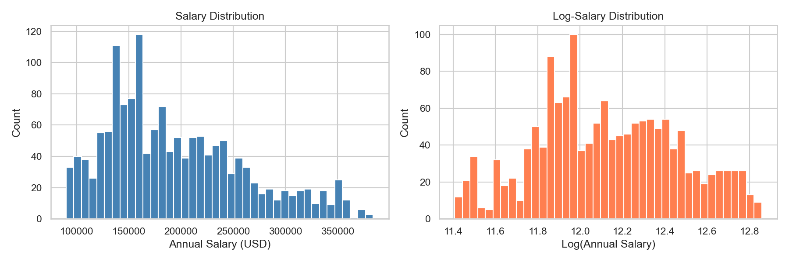

The raw salary distribution has a skewness of 0.72, meaning a right tail of
high-paying roles pulls the mean above the median. Mean is $194,892 against a
median of $180,000. This moderate skew is flagged here and addressed in Notebook 2
with a log transform.

### Salary by Experience Level

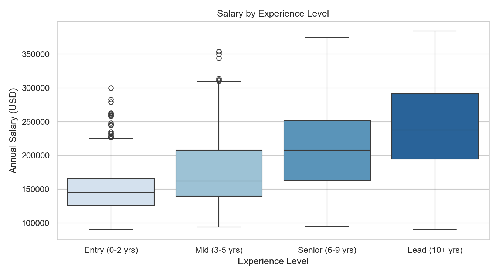

| Experience Level | Median Salary |
|-----------------|--------------|
| Entry (0-2 yrs) | $145,000 |
| Mid (3-5 yrs) | $162,000 |
| Senior (6-9 yrs) | $208,000 |
| Lead (10+ yrs) | $238,000 |

Experience level is the strongest single predictor in the dataset, with a $93,000
gap between Entry and Lead. The jump from Mid to Senior ($46K) is larger than the
jump from Entry to Mid ($17K), which suggests seniority is disproportionately
rewarded in this market.

### Salary by Country

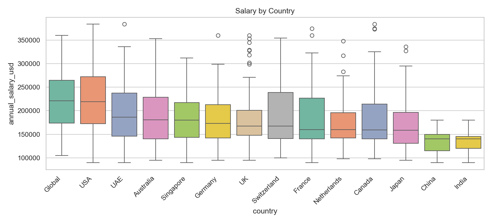

| Country | Median Salary |
|---------|--------------|
| Global / USA | $219,000 - $221,000 |
| UAE, Australia, Singapore | $180,000 - $187,000 |
| UK, Germany, Switzerland | $167,000 - $173,000 |
| India, China | $140,000 |

A $81,000 gap exists between the top and bottom countries. Country becomes one of
the strongest categorical features after encoding. India and China at the lower end
reflect real-world USD-adjusted market rates for AI roles.

### Salary by Company Size

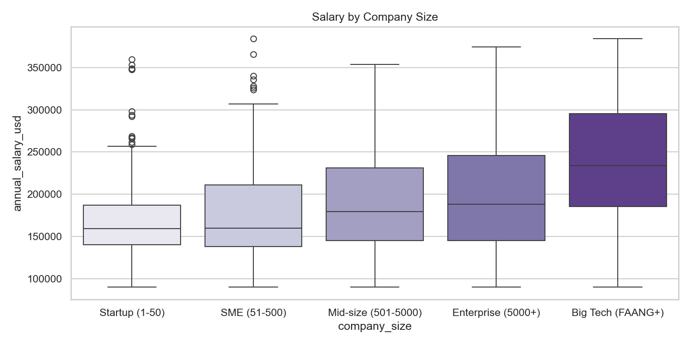

Big Tech (FAANG+) pays a $74,500 median premium over Startups. The progression from
Startup to Enterprise is gradual. The jump from Enterprise to Big Tech is abrupt at
$46,000, confirming that FAANG-tier companies operate in a separate compensation bracket.

### Salary by Job Title (Top 15)

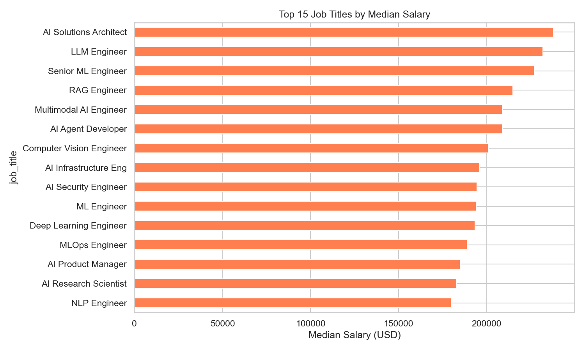

AI Solutions Architect, LLM Engineer, and Senior ML Engineer lead the top. AI Business
Analyst and Prompt Engineer sit at the bottom with a $122,000 spread across all 25 titles.
Governance and adjacent roles pay significantly less than deep technical specialisations.

### Salary by Remote Work

Remote work status has a median salary gap of only $2,000 across Fully Remote, Hybrid,
and On-site. It is included in the model for completeness but is not expected to
contribute meaningful signal.

### Key EDA Takeaways

- Strongest predictors (before encoding): `experience_level`, `company_size`, `country`, `job_title`
- Weakest predictors: `remote_work` (near-zero variance), `years_of_experience` (raw correlation 0.08)
- Target needs a log transform before regression
- All categorical columns need encoding before modelling

---

## Notebook 2: Feature Engineering

The second notebook converts the 9 human-readable columns into the 54 numeric features
the model actually trains on. Every decision here has a specific reason.

### Log Transform of the Target

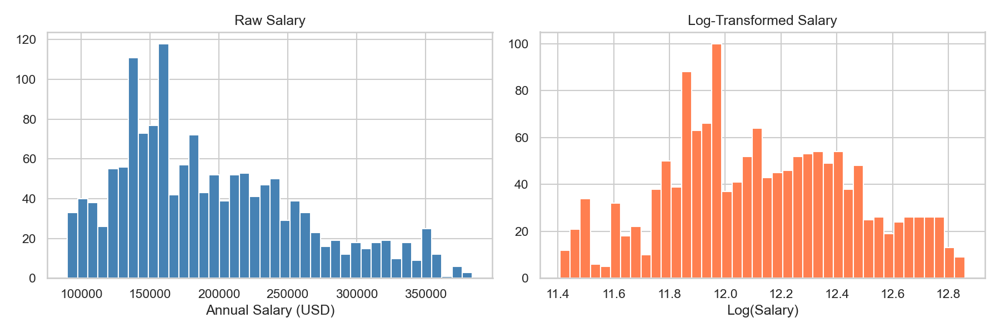

Skewness of 0.72 on raw salary becomes 0.09 after applying `log(salary)`. This matters
because linear regression assumes the residuals are normally distributed. A skewed target
pushes the residuals out of that shape. After log transform, the distribution is close
to symmetric and the model assumption holds.

All predictions from the model come out in log space and are converted back to dollars
with `numpy.exp()`.

### Ordinal Encoding

Three columns have a natural rank order and are encoded as integers to preserve that
ordering information. One-hot encoding these would throw away the fact that Lead is
above Senior is above Mid is above Entry.

| Column | Encoding |
|--------|----------|
| `experience_level` | Entry=1, Mid=2, Senior=3, Lead=4 |
| `education_required` | Bootcamp=1, Associate's=2, Bachelor's=3, Master's=4, PhD=5 |
| `company_size` | Startup=1, SME=2, Mid-size=3, Enterprise=4, Big Tech=5 |

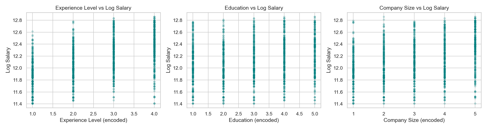

Experience level and company size show a clean upward trend against log salary. Education
shows a weaker and less consistent pattern. Bootcamp/Self-taught earns more than
Associate's and almost matches Bachelor's in this dataset, which technically breaks the
ordinal assumption. This is a known limitation and is documented in the Limitations
section.

### One-Hot Encoding

Four nominal columns with no natural order are one-hot encoded using `pandas.get_dummies`
with `drop_first=True`. Dropping the first category avoids perfect multicollinearity,
which would make the linear regression matrix non-invertible.

| Column | Categories | Columns Generated |
|--------|-----------|------------------|
| `job_title` | 25 | 24 |
| `country` | 14 | 13 |
| `remote_work` | 3 | 2 |
| `industry` | 12 | 11 |

**Note on pandas versions:** pandas 2.0+ returns boolean dtype from `get_dummies`. All
boolean columns are explicitly cast to int before any further processing. Without this
step, correlation calculations and coefficient interpretation produce unreliable results.

### Feature Correlation with Log Salary

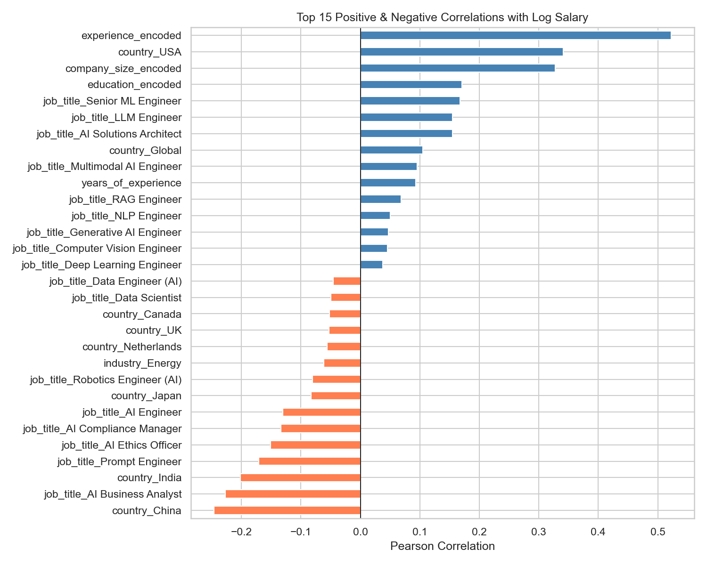

After encoding, the top positive correlations with log salary are:

| Feature | Pearson Correlation |
|---------|-------------------|
| experience_encoded | +0.523 |
| country_USA | +0.341 |
| company_size_encoded | +0.328 |
| education_encoded | +0.171 |
| job_title_Senior ML Engineer | +0.168 |

The top negative correlations are:

| Feature | Pearson Correlation |
|---------|-------------------|
| country_China | -0.246 |
| job_title_AI Business Analyst | -0.227 |
| country_India | -0.202 |
| job_title_Prompt Engineer | -0.171 |
| job_title_AI Ethics Officer | -0.151 |

Experience encoded at 0.52 is the single strongest numeric signal, which is consistent
with what EDA showed before encoding.

### Scaling

`StandardScaler` is applied to the four continuous or ordinal-encoded numeric columns:
`years_of_experience`, `experience_encoded`, `education_encoded`, `company_size_encoded`.
One-hot encoded columns (already 0 or 1) are not scaled.

Scaling is necessary because `years_of_experience` ranges from 1 to 15, while ordinal
columns range from 1 to 4 or 1 to 5. Without scaling, the coefficient magnitudes are
not comparable across features. The fitted scaler is saved to `models/scaler.pkl` for
consistent application at inference time.

### Final Dataset

After all transformations: 1,500 rows, 54 feature columns, 1 target column (`log_salary`).
All columns are numeric. Zero null values. Saved to `data/processed/model_ready.csv`.

---

## Notebook 3: Model Training and Evaluation

### Train / Test Split

80/20 split with `random_state=42`. Training set: 1,200 samples. Test set: 300 samples.
The split is fixed for all evaluation.

### Model

`sklearn.linear_model.LinearRegression`, no regularization, no hyperparameter tuning.
The model is intentionally kept simple. The goal is to show what linear regression can
do on a well-prepared feature set, not to squeeze out maximum performance with
regularization or polynomial terms.

### Results

| Metric | Value |
|--------|-------|
| Train R² | 0.8701 |
| Test R² | **0.8395** |
| MAE (USD) | **$18,824** |
| RMSE (USD) | **$24,991** |
| 5-Fold CV Mean R² | **0.8514** |
| 5-Fold CV Std | 0.0248 |

The model explains 84% of salary variance on unseen data. The train-test gap is 0.03,
which rules out meaningful overfitting. A 5-fold cross-validation mean R² of 0.85 with
tight standard deviation of 0.025 confirms the result is consistent across different
data splits and not a product of a lucky single split.

### Prediction Accuracy in Dollar Terms

| Error Threshold | Predictions Within | Percentage |
|----------------|-------------------|-----------|
| Within $10,000 | 109 / 300 | 36.3% |
| Within $20,000 | 200 / 300 | **66.7%** |
| Within $30,000 | 237 / 300 | 79.0% |
| Within $50,000 | 284 / 300 | 94.7% |

Two-thirds of all predictions are within $20,000 of the actual salary. 94.7% are within
$50,000. These numbers are more meaningful to a non-technical reader than RMSE alone.

### Actual vs Predicted

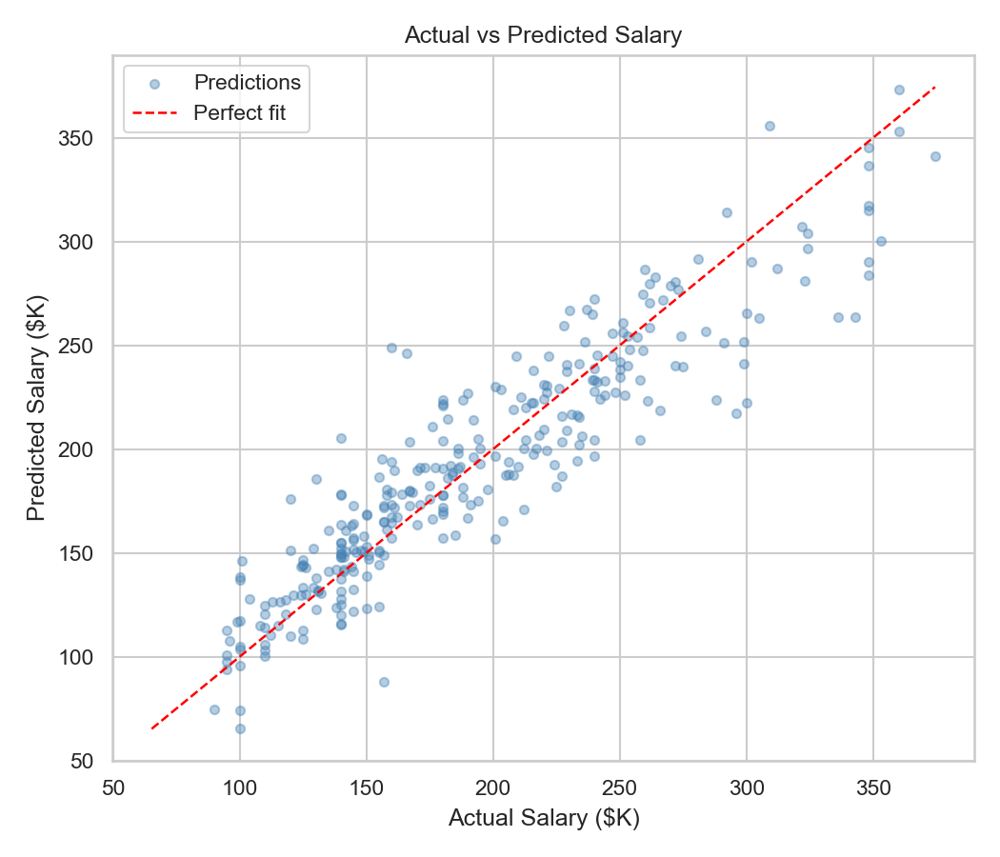

Points cluster tightly around the perfect-fit line across the $90K to $370K salary
range. The fit is strongest in the $120K to $220K mid-range where training data is
densest. A cluster of high-salary roles above $300K tends to sit below the line,
meaning the model underestimates top-tier salaries. This is expected behavior: the
thin high-salary tail is too sparse for the model to learn the full pattern.

### Residuals

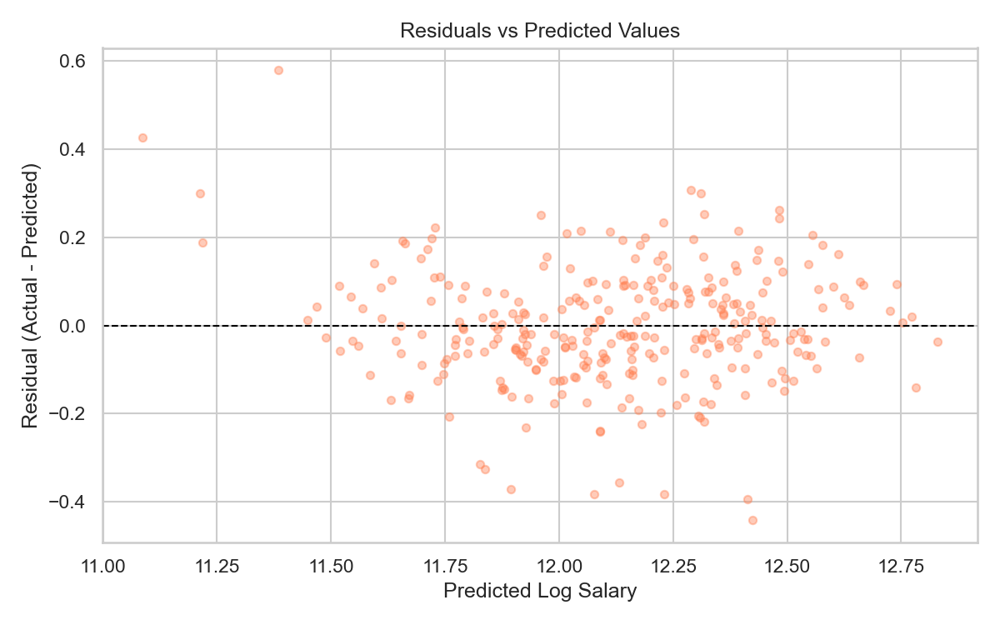

Residuals are centered around zero across the full prediction range (log salary 11.0 to
12.8). No systematic directional drift is visible. Residual mean is -0.006, which is
effectively zero. Two outliers are visible in the low-salary range where the model
overestimates.

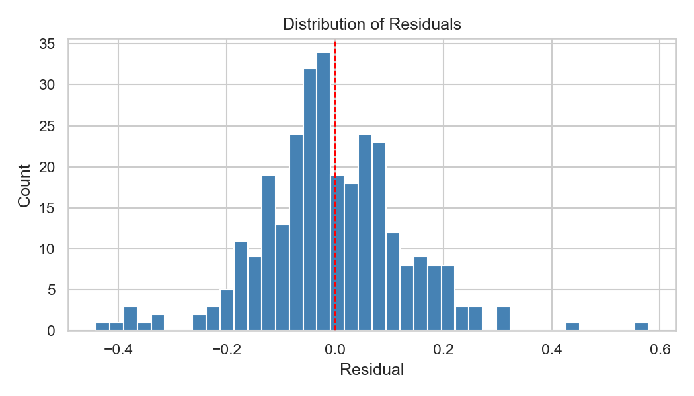

The histogram is approximately bell-shaped and centered just left of zero. The
distribution is mildly right-skewed, reflecting the model's tendency to underpredict
at the high end more than it overpredicts at the low end. For a linear regression
model, this is close to the expected behavior.

### Feature Coefficients

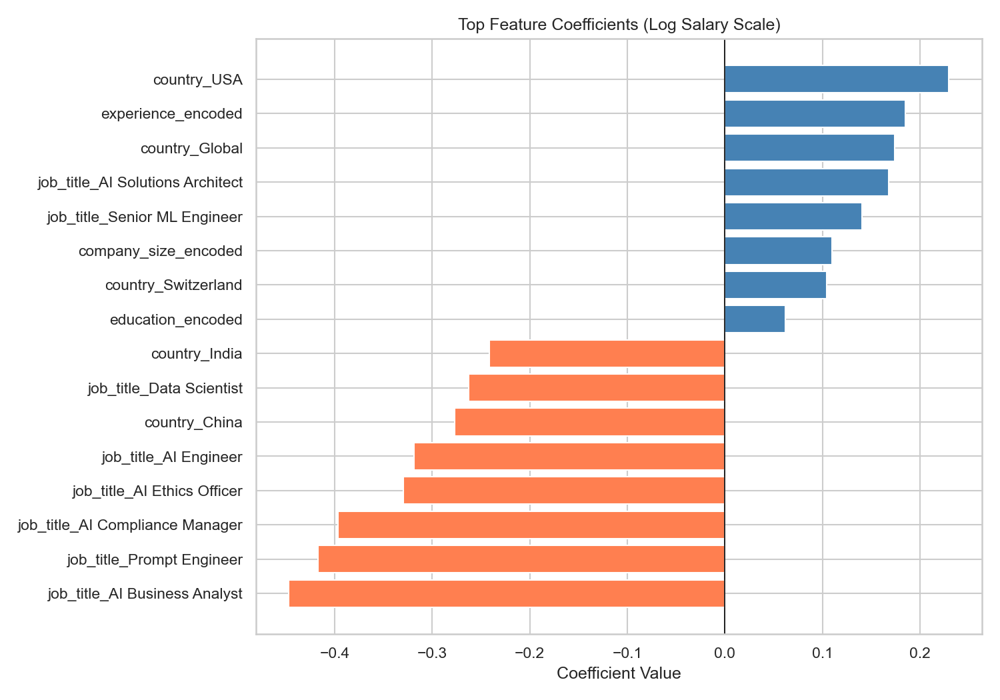

Coefficients are in log salary scale. The approximate percentage effect is
`(e^coefficient - 1) * 100`.

**Top salary boosters:**

| Feature | Coefficient | Approx. Effect |
|---------|------------|---------------|
| country_USA | +0.230 | +26% vs Australia |
| experience_encoded | +0.185 | +20% per std dev |
| country_Global | +0.174 | +19% |
| job_title_AI Solutions Architect | +0.168 | +18% vs baseline |
| job_title_Senior ML Engineer | +0.140 | +15% |
| company_size_encoded | +0.110 | +12% per std dev |
| country_Switzerland | +0.104 | +11% |
| education_encoded | +0.062 | +6% per std dev |

**Top salary reducers:**

| Feature | Coefficient | Approx. Effect |
|---------|------------|---------------|
| job_title_AI Business Analyst | -0.447 | -36% vs baseline |
| job_title_Prompt Engineer | -0.417 | -34% |
| job_title_AI Compliance Manager | -0.397 | -33% |
| job_title_AI Ethics Officer | -0.329 | -28% |
| country_China | -0.277 | -24% |
| country_India | -0.242 | -21% |

The baseline for country is Australia (dropped reference category). The baseline for
job title is AI Agent Developer (first alphabetically, dropped by `drop_first=True`).

---

## Streamlit App

The app has three tabs:

**Predict** - Select job title, experience level, years of experience, education,
country, company size, industry, and remote work. Click Predict Salary to get an
estimated annual salary with a likely range and a percentile badge showing where the
prediction sits in the dataset. A breakdown panel shows which factors are boosting
or reducing the salary for that specific combination.

**Explore the Market** - Choose any dimension (experience, country, company size, job
title, industry, education, remote work) and see a sorted bar chart of median salaries
alongside a breakdown table.

**Model Performance** - Four metric cards for R², MAE, RMSE, and CV R². A prediction
accuracy table, residual distribution chart, actual vs predicted scatter, and coefficient
chart. All charts are regenerated live from the saved model.

To run:
```bash
streamlit run streamlit/app.py
```

---

## Results

| What | Value |
|------|-------|
| Features used | 54 (after encoding 9 raw columns) |
| Test R² | 0.8395 |
| 5-Fold CV R² | 0.8514 (+/- 0.025) |
| MAE | $18,824 |
| RMSE | $24,991 |
| Predictions within $20K | 66.7% |
| Predictions within $50K | 94.7% |

The top three salary drivers the model learned: experience level, USA location, and
Big Tech company size. The top three salary reducers: AI Business Analyst title,
China/India location, and non-technical governance roles.

---

## Limitations

**Synthetic dataset characteristics.** The dataset shows signs of curation: round salary
values, near-perfectly balanced category counts, and unusually clean distributions.
Performance on scraped real-world job posting data would likely be lower. This is
appropriate to note if presenting the project in a professional context.

**Education ordinal encoding assumption.** Bootcamp/Self-taught was assigned an encoding
of 1 (lowest), but in the data it earns more than Associate's and nearly matches
Bachelor's. The ordinal encoding slightly misrepresents the education-salary relationship
at the lower end. A better approach in a future version would be to either one-hot encode
education or treat Bootcamp as its own non-ordinal category.

**Top earner underprediction.** The model consistently underestimates salaries above
$300,000. Big Tech plus Lead experience plus USA location form a thin high-salary tail
in the training data. Linear regression cannot extrapolate well beyond its training
distribution, and regularization or a separate model for the upper tail would help.

**No interaction terms.** The model cannot capture combinations like Big Tech plus USA
plus LLM Engineer, which likely commands a premium beyond what each feature contributes
independently. A polynomial feature expansion or a tree-based model would handle this.

**Required skills dropped.** The `required_skills` column (pipe-delimited multi-label
strings like `Python|Cloud|LLM APIs`) was excluded in this version due to 1,500 unique
combinations. A future version could multi-hot encode the most frequent skills and test
whether they add signal.

**Static dataset.** The model was trained on a fixed snapshot. It does not update with
new job postings and will drift as the market changes.

---

## How to Reproduce

**1. Clone the repository and set up the environment**

```bash
git clone https://github.com/BibekSubediCR7/AI-Job-Market-Salary-Prediction
cd AI-Job-Market-Salary-Prediction
pip install -r requirements.txt
```

**2. Download the dataset**

Download from Kaggle: https://www.kaggle.com/datasets/alitaqishah/ai-jobs-market-2025-2026-salaries

Place the CSV at `data/raw/ai_jobs_market.csv`.

**3. Run the full pipeline**

```bash
python main.py
```

This runs load, validate, preprocess, train, evaluate, save model, and generate plots
in one command. All outputs go to `data/processed/`, `models/`, and `reports/`.

**4. Run the notebooks (optional)**

The three notebooks in `notebooks/` walk through the same steps with explanations and
intermediate outputs. Run them in order: 01, 02, 03.

**5. Launch the app**

```bash
streamlit run streamlit/app.py
```

---

## Requirements

```
pandas
numpy
scikit-learn
matplotlib
seaborn
streamlit
```

Install with:

```bash
pip install -r requirements.txt
```

Python 3.9 or above recommended.

---

## Author

**Bibek Subedi**  
Aspiring ML Engineer, AI and Data Science  
GitHub: https://github.com/BibekSubediCR7  
LinkedIn: https://www.linkedin.com/in/bibeksubedicr7

---

&copy; 2026 Bibek Subedi. Made with love.